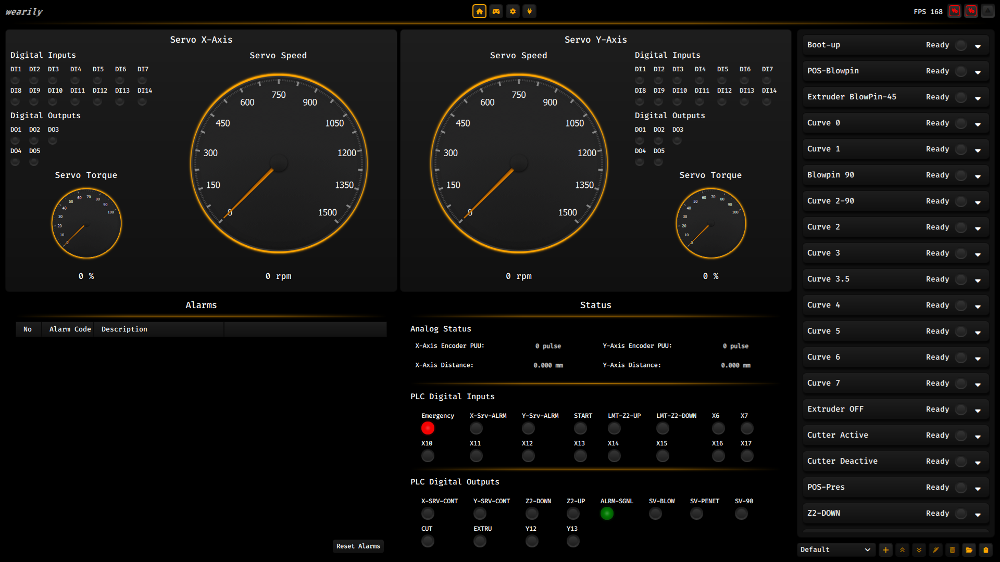
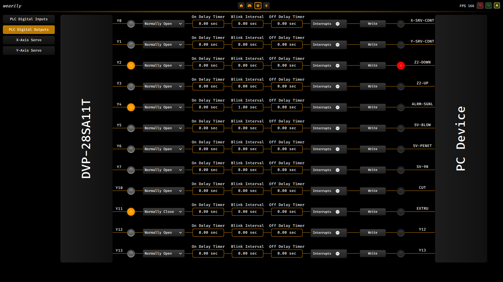
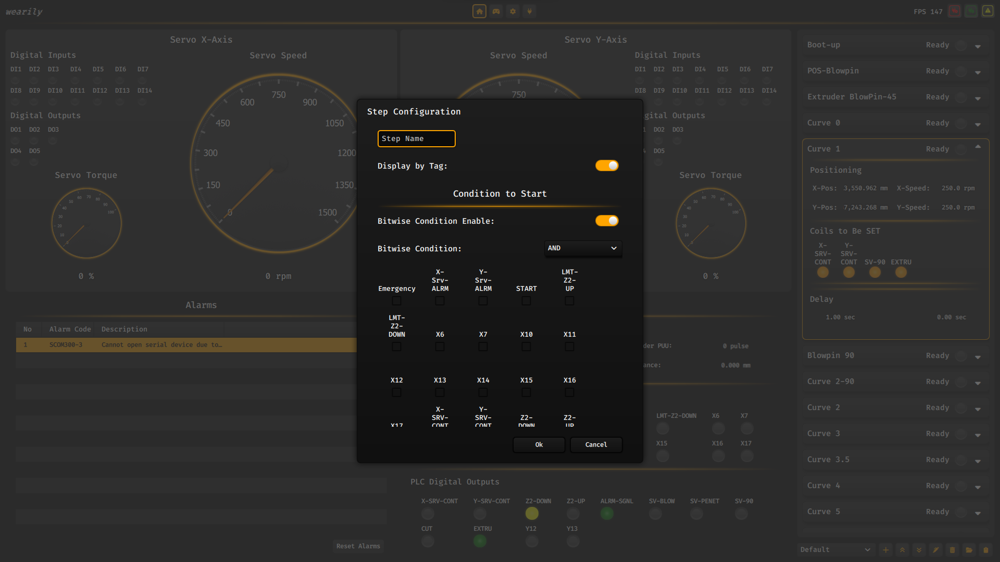
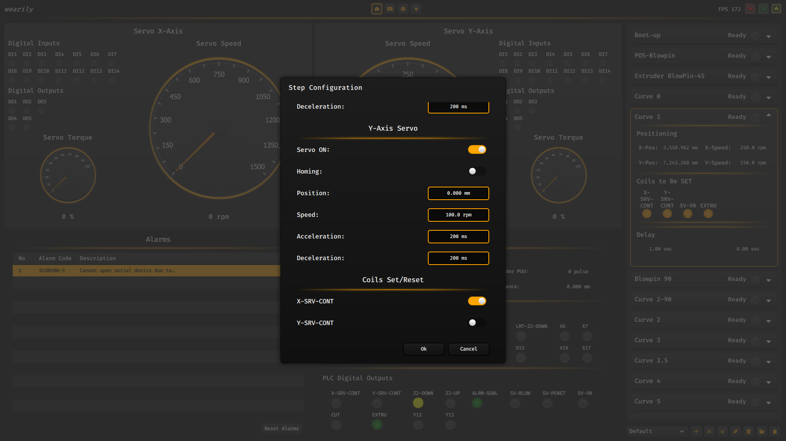
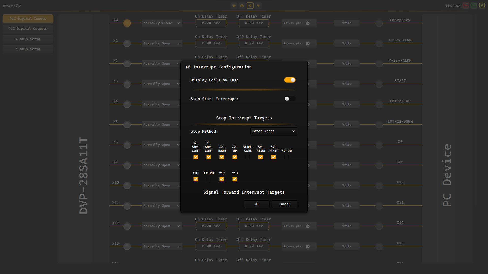
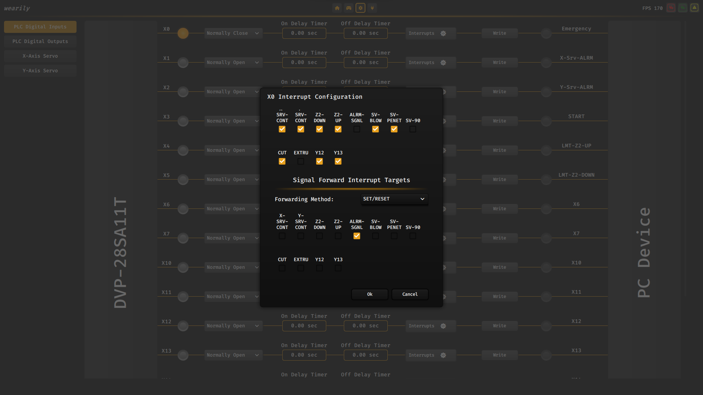

# WeaMachine

> A configurable industrial automation framework for PLC-controlled machinery, motion systems, and custom manufacturing equipment.

WeaMachine is a runtime-configurable machine control platform built with C++, Qt, and QML. It combines PLC integration, servo motion control, step-based automation, recipe management, and operator-friendly machine configuration into a unified application.

Instead of hardcoding machine behavior inside PLC ladder logic or application source code, machine workflows can be configured directly through the user interface.

---

## Table of Contents

- [Overview](#overview)
- [Screenshots](#screenshots)
- [Core Features](#core-features)
- [Runtime PLC Configuration](#runtime-plc-configuration)
- [Motion Control](#motion-control)
- [Step-Based Automation Engine](#step-based-automation-engine)
- [Recipe Management](#recipe-management)
- [Machine Monitoring](#machine-monitoring)
- [Manual Mode](#manual-mode)
- [Automatic Mode](#automatic-mode)
- [Architecture](#architecture)
- [Technology Stack](#technology-stack)
- [Design Goals](#design-goals)
- [Project Status](#project-status)

---

## Overview

WeaMachine was designed to provide a flexible runtime automation layer for industrial machines.

The platform enables machine builders and integrators to configure machine behavior without modifying application code or PLC programs.

Typical use cases include:

- Servo-driven machinery
- Packaging systems
- Blow molding machines
- Pick & place systems
- Conveyor systems
- Assembly equipment
- Custom manufacturing machines

---

## Screenshots

### Main Dashboard



---

### PLC Configuration



---

### Step Configuration






---

### PLC IO Rules






---

## Core Features

### Dynamic PLC I/O Configuration

Configure machine inputs and outputs at runtime.

Supported features:

- Dynamic I/O registration
- Input/output aliasing
- Normally Open (NO) logic
- Normally Closed (NC) logic
- Runtime signal inversion
- Input filtering
- Output filtering
- Persistent configuration storage

---

### Signal Timing System

Each signal can be extended with configurable timing behavior.

Available options:

- On Delay
- Off Delay
- Blink Interval
- Runtime activation control

This allows machine behavior to be modified without changing PLC logic.

---

### Alias-Based Operator Interface

PLC addresses are useful for engineers but often difficult for operators.

WeaMachine allows assigning human-readable aliases to every signal.

Example:

```text
X0  -> Emergency Stop
X1  -> Front Door Sensor
X2  -> Product Detector

Y0  -> Main Valve
Y1  -> Alarm Buzzer
Y2  -> Pneumatic Cylinder
```

The operator interface can display aliases instead of raw PLC addresses.

---

## Motion Control

Integrated servo motion subsystem with support for:

- Servo ON/OFF
- Homing
- Absolute positioning
- Relative positioning
- Jog control
- Speed configuration
- Acceleration control
- Deceleration control
- Torque monitoring
- Position feedback

The system supports multi-axis industrial motion workflows.

---

## Step-Based Automation Engine

The automation engine is based on configurable execution steps.

Each step may contain:

### Step Metadata

```text
Step Name
```

### Conditional Logic

Supported logic operators:

```text
AND
OR
XOR
```

Example:

```text
Emergency Stop = OFF
AND
Safety Door = CLOSED
AND
Product Sensor = ON
```

### Motion Actions

```text
X Axis Position
Y Axis Position

Speed
Acceleration
Deceleration
```

### PLC Actions

```text
Set Coil
Reset Coil
Activate Output
Deactivate Output
```

### Transition Delay

```text
Next Step Delay = 200 ms
```

---

## Recipe Management

The platform supports multiple machine recipes.

Each recipe can contain:

- Step sequences
- Motion parameters
- Servo positions
- Coil configurations
- Timing values
- Machine-specific settings

Operators can switch between machine profiles without modifying application code.

---

## Machine Monitoring

Real-time monitoring interface providing:

- PLC input status
- PLC output status
- Servo speed
- Servo torque
- Position feedback
- Encoder values
- Alarm information
- Runtime machine state

---

## Manual Mode

Manual mode is intended for:

- Machine commissioning
- Maintenance
- Diagnostics
- Troubleshooting
- Hardware verification

Capabilities include:

- Manual output control
- Servo jogging
- Homing operations
- Position testing
- Runtime parameter adjustment

---

## Automatic Mode

Automatic mode executes predefined machine workflows.

Features include:

- Step execution
- Conditional transitions
- Motion synchronization
- Output control
- Delay management
- Recipe execution

---

## Architecture

```text
┌─────────────────────────┐
│      Qt/QML UI          │
└────────────┬────────────┘
             │
┌────────────▼────────────┐
│   Automation Engine     │
│    Step Sequencer       │
└───────┬────────┬────────┘
        │        │
        ▼        ▼

 PLC Layer   Motion Layer
 (Modbus)     (Servos)
```

---

## Technology Stack

- C++17
- Qt
- QML
- OpenGL
- Modbus RTU
- Delta PLC Integration
- Delta Servo Integration
- Multi-threaded Architecture

---

## Design Goals

- Runtime Configurability
- Operator-Friendly Configuration
- Minimal PLC Modifications
- Flexible Machine Integration
- Reusable Automation Components
- Industrial Reliability

---

## Project Status

🚧 Active Development

The project is currently under active development.

Planned improvements include:

- Advanced motion profiles
- Extended condition system
- Configuration import/export
- Additional diagnostics
- Enhanced visualization
- Machine simulation mode

---

## Author

**Parsa Pournabi (Wearily)**

Industrial Automation & Software Engineering

C++ • Qt/QML • OpenGL • PLC Integration • Motion Control

---

## TODO

### UI/Front

- [ ] Manual GroupBoxes should be enable only when its servo ON and Manual mode is ON.
- [ ] Complete Record Table and model.
- [ ] Add 'General' Setting Page with these sections: [ Axes Configuration, Step Configuration ]
	
- [ ] Step Configuration:
    - [x] Always ON Output while Step is Running ( it takes a list of outputs )
    - [x] Step Restart Method [ Manually, Reset & Home, Reset and continue ]
    - [ ] Encoder Properties:
    - [x].Tolerance value for X/Y Axes
    - [x] Number of the retries
    - [x] Number of Delay for Checking
    - [x] Mode when encoder error has occured --> [ Emergency and Stop after Delay of checking is completed and has error, Retry again (send GotoPos and continue until the retry counts is reached) ]
    - [ ] Number of Tolerance for Homing Method (Low priority)
		
- [ ] Add Step Starting from a specific step.
- [ ] Fix Manual Scaling for Position
- [ ] Add Notification and Alarm Sound (Low priority)
- [ ] Connect these new UIs with Backend
- [ ] Optimize UI 

### Backend

- [ ] ADD RecordTable model logic.
- [ ] ADD Alarm for when a specific Step cannot be execute or is freezing.
- [ ] ADD Counter register for when Step flow is done.
- [ ] Make Homing Smarter
- [ ] Auto Connect of TCP/Serial
- [ ] Fix Sometimes Servo will freeze at specific Step (Because of Servo Encoder error and we also have an encoder checking for reaching position.
    you can fix this by using it an option into the general setting.
- [ ] Servo OFF at Start ---> Done (But sometimes has an issue)

### General
